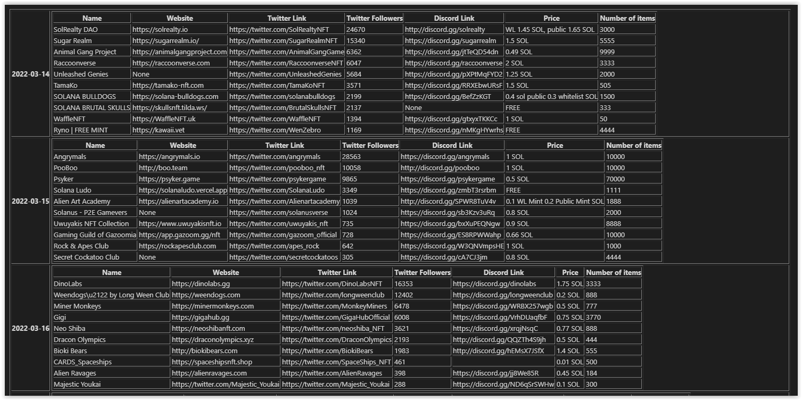

# Which solana nfts to mint next 


## 🎯 Description 

The objective of this job is to help you choose which nft project to mint in the following days. 

The job will retrieve data from howrare.is. The data are then filtered, sorted according to the number of twitter followers then displayed in json and htm files.

## Installation

### Prerequisites

To begin install the requirements

```bash
pip install -r requirements.txt
```

### 🚀 Execute the script

To execute the job, you may use python3. 

```bash
$ python run.py 
```

### Input variables

You may modify default parameters to execute the job. 

The input variables, with their default values:

|     **Parameter**     |      **Default value**      | **Description**                                                                                                                                                               |
|:---------------------:|:---------------------------:|-------------------------------------------------------------------------------------------------------------------------------------------------------------------------------|
| `--top`           | `10`            | Number of assets to display per day. |
| `--period`           | `14`            | Number of days to analyse. |

### 📈 Result files

The result files created after the execution of the script. 

|      **File names**      | **Description**                                                                                                                                                               |
|:---------------------------:|-------------------------------------------------------------------------------------------------------------------------------------------------------------------------------|
| `howrareis_source.json`            | Raw data retrieved from howrare.is in a json format. |
| `howrareis_reformated.json`            | filetered, then sorted results in a json format.  |
| `index.htm`            | Reformated file transformed in a html format. |

## 🤯 How to use it

Default usages :

```
$ python src/run.py 
```

With Parameters :
```
$ python src/run.py --top 5 --period 10
```


## How to use the docker image

```bash
# Build locally the image of the docker container
$ docker build nextsolananft2mint
# Create a local volume to associate with the running container. Result files of the job will then be accessible.  
$ docker volume create myvol
# Running Container
$ docker run --mount source=myvol,target=/data nextsolananft2mint
```

You may find a already builded Docker image [here](https://hub.docker.com/r/trickytibo/next_solana_nft2mint). 

The result after executing the script : 



## A coffee ? 

If you are pleased with the work done, you might pay me a coffee (Solana Address)  ;) 

```bash
H1X6sguyTdeATQXCDGgiqdHSpAkxHN63zE7x9QAuq7y7
```